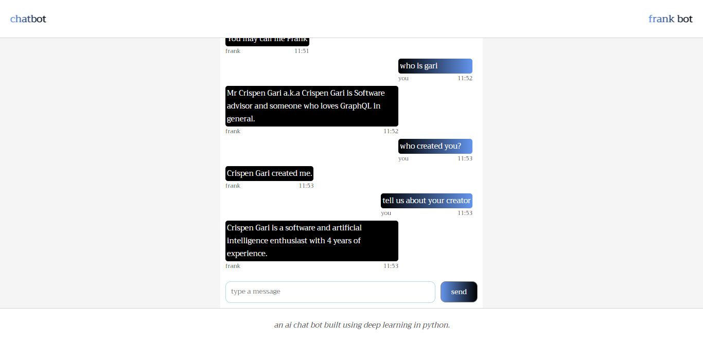

### Web Client

This is a client application that will consume the graphql api from the graphql server using. We are going to use the graphql code generator to consume the graphql mutation from the bot server.

### User interface

The `ui` for the web client will be looking as follows, and it will be `100%` responsive even on mobile devices.

### Languages used for the client application

I used typescript as a programming language for the web client.
